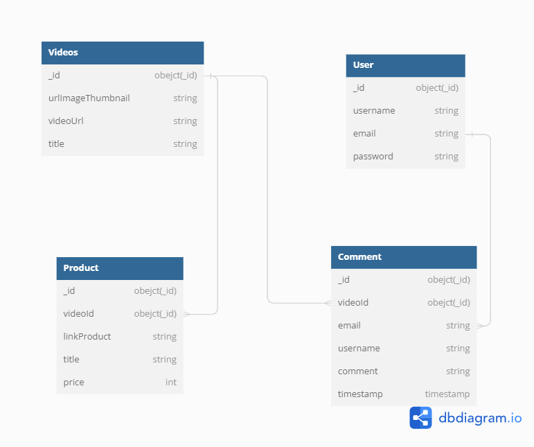

## Midterm tokopedia play

Pada midterm ini saya membuat restapi dengan integrasi mongoDB untuk databasenya. Teknologi dan Library yang saya gunakan

- [x] Express.js
- [x] bcryptjs
- [x] jsonwebtoken
- [x] mongoose
- [x] nodemon
- [x] dotenv

## How to run app

1. `npm install ` or `npm ci`
2. insert `.env` database and jwt key
3. and `npm run dev` for run a server

## Database Structure



- Videos 1 - N Comments
- videos 1 - N Products
- User 1 - N Comments

# API List

## Videos

**_Video object_**

```yaml
{
title: string
videoUrl: string
urlImageThumbnail: string
}
```

- **_GET /videos_**
  Retrieves all videos in the system.

  - **_URL Params_**
    None
  - **_Headers_**
    None
  - **_Success Response:_**
    `Code: 200`
  - **_Content:_**

    ```yml
    {
      "count": 5,
      "videos":
        [
          {
            "videoID": "64bfe42736a3ba8369906eb3",
            "title": "cek",
            "urlImageThumbnail": "cek.jpg",
            "videoUrl": "cek.mp4",
          },
          {
            "videoID": "64bff0fbdb78f8cc5dd7609d",
            "title": "thumbnail-2",
            "urlImageThumbnail": "cek2.jpg",
            "videoUrl": "ccek.mp4",
          },
          {
            "videoID": "64c2928ed8d63c0aab1fb2c7",
            "title": "thumbnail-4",
            "urlImageThumbnail": "cek3.jpg",
            "videoUrl": "cek3.mp4",
          },
          {
            "videoID": "64c29343d8d63c0aab1fb2ca",
            "title": "thumbnail-4",
            "urlImageThumbnail": "cek3.jpg",
            "videoUrl": "cek3.mp4",
          },
          {
            "videoID": "64c29b2f6b760b4aa7d20ce3",
            "title": "Peralatan Dapur",
            "urlImageThumbnail": "gambar-thumbnail.jpg",
            "videoUrl": "peralatan-video.yt",
          },
        ],
    }
    ```

- **_POST /videos_**
  Creates a new video in the system.

  - **_URL Params_**
    None
  - **_Data Params_**
    ```yml
    { "title": string, "urlImageThumbnail": string, "videoUrl": string }
    ```
  - **_Headers_**
  - **_Content-Type: application/json_**
  - **_Success Response:_**
    Code: 200
  - **_Content:_**

  ```yml
  { message: "Video created successfully" }
  ```

- **_GET /videos/:id_**
  Retrieves a specific video by its ID.

  - **_URL Params_**
    id (string) - ID of the video to retrieve.
  - **_Headers_**
    None
  - **_Success Response:_**
    Code: 200
  - **_Content:_**
    ```yml
    {
      "message": "Get video successfully",
      "video": { "title": "thumbnail-4", "videoUrl": "cek3.mp4" },
      "product": [products],
    }
    ```

## Users

**_User object_**

```yaml
{
username: string
email: string
password: string
}
```

- **_POST /signup_**
  Creates a new user account.

  - **_URL Params_**
    None
  - **_Data Params_**
    ```yml
    { "email": string, "username": string, "password": string }
    ```
  - **_Headers_**
  - **_Content-Type: application/json_**
  - **_Success Response:_**
    Code: 200
  - **_Content:_**

  ```yml
  { message: "User created successfully" }
  ```

  - **_Error Response:_**
  - **_Code: 400_**
  - **_Content:_** { "error": "E11000 duplicate key error collection: tokopedia_play.users index: email_1 dup key: { email: \"gozzafadillah@gmail.com\" }" }

- **POST /signin**
  Signs in a user.

  - **_URL Params_**
    None
  - **_Data Params_**
    `yml
        {
"email": string,
"password": string
}
`

  - **_Headers_**
  - **_Content-Type:_** application/json
  - **_Success Response:_**
  - **_Code:_** 200
  - **_Content:_**

    ```yml
    { message: "User signed in successfully" }
    ```

  - **_Error Response:_**
  - **_Code:_** 401
  - **_Content:_** { "error": "Invalid credentials" }

## Comments

Comment object

```yml
  {
  comment: string
  username: string
  email: string
  videoId: string
  }
```

## Comments

- **_POST /comments_**
  Creates a new comment on a video.

      - **_URL Params_**
        None
      - **_Data Params_**

      ```yml
      { "comment": string }
      ```

  - **_Headers_**
    - none
  - **_Content-Type:_** application/json
  - **_Success Response:_**
  - **_Code:_** 200
  - **_Content:_**

  ```yml
  { message: "Comment created successfully" }
  ```

- **GET /comments/:videoId**
  Retrieves all comments in the system.

  - **_URL Params_**
    None
  - **_Headers_**
    None
  - **_Success Response:_**
  - **_Code:_** 200
  - **_Content:_**

  ```yml
    {
    comments: [
    {
    comment: "Comment 1",
    username: "user1",
    email: "video1",
    },
    {
    comment: "Comment 2",
    username: "user2",
    email: "video1",
    }
    // More comments...
    ]
    }
  ```

## Product

- **POST /product/:videoId**
  Creates a new product related to a specific video.

  - **_URL Params_**
    videoId (string) - ID of the video to associate the product with.
  - **_Data Params_**

  ```yml
  { "videoId": string"name": string, "price": number, "description": string }
  ```

  - **_Headers_**
    - Authorization: `Bearer <token>`
  - **_Content-Type:_** application/json
  - **_Success Response:_**
    Code: 200
  - **_Content:_**
    ```
      {
        message: "Product created successfully",
      }
    ```
